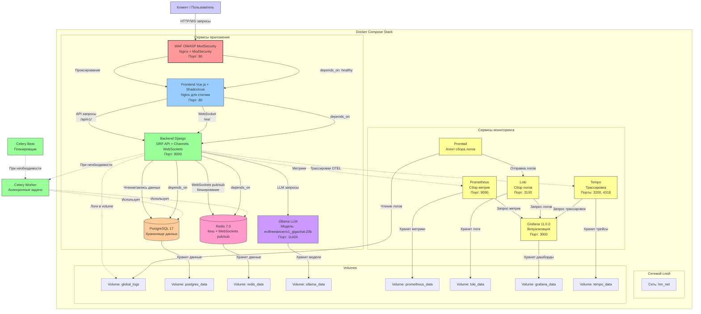
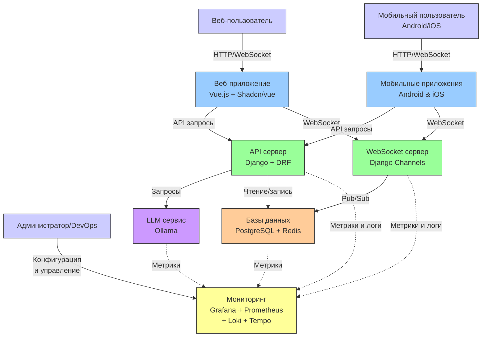

# Builder Platform

Немного наскальных рукописей, что к чему.

## На чем разворачивал

|  Характеристика  |   Значение  |
| --- | --- |
|  Количество нод   |  1   |
| CPU | 4 |
| RAM | 32 Гб |
| Disk | 100 Гб |
| GPU | 1x Tesla T4 |

> [!NOTE]
> На тачке кстати был предустановлен докер и 535 драйвер, если че их установки в плейбуках нет.

## Технологический стек

- Фронтэнд: `Vue.js` + `Shadcn/vue`
- Бэкэнд: `Django` (API на `DRF`, веб-сокеты на `Django Channels`)
- `Celery worker` (асинхронные операции) и `beat` (по таймеру) предусмотрены, но пока не пригодились
- Реляционная СУБД `Postgres`
- `Redis` для веб-сокетов
- LLM запускается на ollama, модель `evilfreelancer/o1_gigachat:20b` вроде норм себя на демо показала.

Это основное. Там еще мониторинг Grafana, Prometheus, Loki, экспортеры, интегрировано на полшишки. Трейсы не было времени. 

> [!NOTE]
> Пытался интегрировать WAF. В `docker-compose.yml` закоментирован сервис ModSecurity, для http работает, стандартные паттерны блочит, но сокеты через этот контейнер не проксируются (опция там специальная есть). Если разберетесь как подружить с сокетами - мне потом расскажите, а то мне тоже интересно.

Ansible плейбуки рабочие. CI/CD тоже.

> [!CAUTION]
> Из проблем безопасности есть вопиющая: захардкоженные креды в initdb.py, в docker-compose.yml. Избавиться от этого в первую очередь.

> [!WARNING]
> И тесты напишите заодно.

## CI/CD

- `.github/workflows/ci-frontend.yml`: собирает бандл фронта, пакует в докер образ и пушит в хранилище, использовалось Selectel.

- `.github/workflows/ci-backend.yml`: собирает образ бэкэнда.

- `.github/workflows/ci-worker.yml`: собирает образ асинхронного воркера/beat 

- `.github/workflows/cd-slow.yml`: нужен если раскатываем на пустом сервере, запускает все плейбуки чтобы настроить сервак с нуля.

- `.github/workflows/cd-fast.yml`: этот запускается на уже настроенном серваке, если надо просто догрузить обновления на прод.

> [!NOTE]
> По триггерам в двух словах: настраивал точечный CI/CD процесс только для измененного компонента (коммит затронул фронт - пересобрали обновили фронт, бэк - бэк, плейбук - прогнали его заново)

### Секреты в CI/CD

- `NEW_USERNAME`: пользователь, под которым логинитесь
- `SERVER_IP`: хост
- `SSH_PRIVATE_KEY`: приватный ssh ключ
- `USER_PASSWORD`: планировался sudo-пароль, но пока в работу не пошел.

По инфраструктуре вроде все. Код описывать в падлу, смотрите сами. 

## Архитектура

### Уровень 1

### Уровень 2

